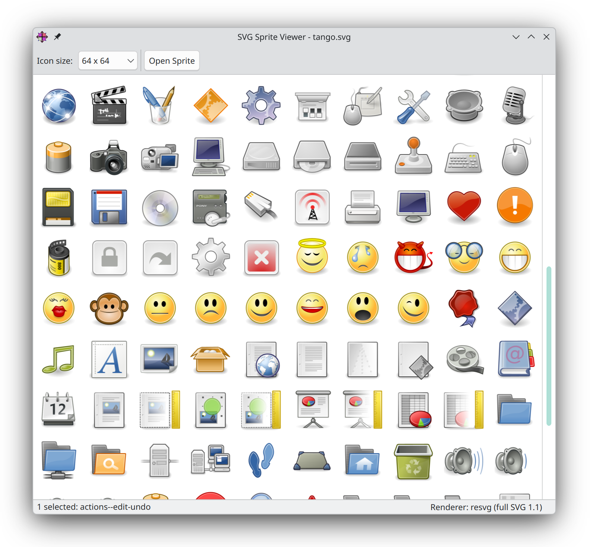

# SVG Sprite Viewer

A small, clean **[PySide6](https://doc.qt.io/qtforpython-6/)** desktop app that opens an
SVG icon sprite (e.g. `icons.svg`), extracts every `<symbol>` and presents the icons in
a responsive tile grid.



## Features

- Parses an SVG sprite and shows all icons as a tile grid; each icon's id is
  shown as a tooltip on hover
- Fast QtSvg (SVG Tiny) rendering by default, with optional full **SVG 1.1**
  via **resvg** (gradients, filters, masks, …) — switchable live from the
  toolbar and via the `--renderer` flag, so sprites like the Tango icon set
  render exactly
- Toolbar dropdown to switch the icon size: 16, 32, 64, 128 or 256 px
- Icons are rendered asynchronously in the background, so the UI stays responsive
- Right-click → **Copy id** or **Copy SVG** puts the fragment id(s) or the
  standalone SVG code on the clipboard (works for single and multi-selection)
- **Open Sprite** button in the status bar loads a different SVG sprite at runtime
- Status bar shows the selection / icon count
- Cross-platform, installable via a one-line installer or `pip`

## Requirements

- Python 3.9+
- PySide6 6.6+
- resvg-py 0.5+ (optional but recommended; falls back to QtSvg when missing)

## Quick start (from source)

```sh
python3 -m venv --system-site-packages .venv   # project-local virtualenv
.venv/bin/python -m pip install -r requirements.txt   # PySide6 + resvg-py
./main.py                                      # opens the default sprite at 64 px
./main.py --size 32                            # same sprite, sized 32 px
./main.py icons.svg --size 64                  # a different sprite file
./main.py --renderer qtsvg                     # fast QtSvg backend (default)
./main.py --renderer resvg                     # full SVG 1.1 (slower, higher fidelity)
```

`./main.py` automatically re-executes itself with `.venv/bin/python` when that
virtualenv exists, so icons always render with the full **resvg** feature set
(gradients, filters, …) instead of the reduced QtSvg fallback. Starting via
`.venv/bin/python main.py` (or an activated venv) works the same way.

### Command-line options

| Option | Values | Description |
|---|---|---|
| `-h`, `--help` | — | show help and exit |
| `-V`, `--version` | — | show the version and exit |
| `-S`, `--size` | `16`, `32`, `64`, `128`, `256` (default `64`) | icon edge length in pixels |
| `-R`, `--renderer` | `qtsvg` (default), `resvg`, `auto` | SVG rendering backend |

All forms work per GNU getopt: `-S 32`, `-S32`, `--size 32`, `--size=32`
(and the same for `--renderer`). The sprite path is purely positional and may
appear before, between or after the options (`--` ends option parsing).

- `qtsvg` (**default**) — Qt's built-in **SVG Tiny** renderer. Much **faster**,
  because it draws straight into the icon image through Qt's native, accelerated
  raster path (no PNG round-trip), but supports only a subset — gradients,
  filters, masks and other advanced features are dropped.
- `resvg` — full **SVG 1.1** via the [resvg](https://github.com/linebender/resvg)
  library: gradients, filters, masks, markers, … render exactly (e.g. the Tango
  icon set). It rasterises the complete spec and hands the result back as a PNG
  that still has to be decoded, so it is **noticeably slower** — especially with
  large sprites.
- `auto` — use **resvg** when installed, otherwise QtSvg.

**Rule of thumb:** for normal, simple icons (flat fills, paths, plain shapes)
keep the default `qtsvg`; reach for `resvg` only when the sprite relies on
gradients, filters, masks or other advanced SVG features.

**At runtime** the toolbar shows a **“Full SVG (resvg)”** checkbox (only when
`resvg-py` is installed). It switches the backend live and re-renders the
current sprite — unchecked means `qtsvg`. The `--renderer` flag sets the initial
state of that checkbox.

The optional `--size` flag accepts 16, 32, 64, 128 or 256 (default 64).

## Installation

### Recommended: dedicated installer

`install.py` installs the app (pip) and registers it in your desktop session:

```sh
python3 install.py
```

It installs into the first of these that works:

1. an active virtual environment,
2. the current user's site-packages (`pip --user`),
3. a dedicated venv under `~/.local/share/spriteviewer/venv`
   (standard for PEP 668 managed systems).

Afterwards the app is registered platform-dependent:

| Platform | Registration |
|---|---|
| **Linux** | `.desktop` entry + hicolor icon in `~/.local/share` |
| **macOS** | app bundle in `~/Applications/Sprite Viewer.app` |
| **Windows** | Start Menu shortcut |

System-wide installation (requires root/admin):

```sh
python3 install.py --system
```

### Via pip

```sh
pip install .
spriteviewer            # launch the installed command
```

## Usage

- **Tile thumbnails** load asynchronously and scale to the selected size.
- **Open Sprite** in the status bar lets you load another SVG sprite without
  restarting the app (a file picker opens where you last loaded from).
- **Right-click** an icon for the context menu: **Copy id** puts the SVG
  fragment id(s) on the clipboard, **Copy SVG** the complete, self-contained
  SVG document of the selected icon(s).
- **Multi-select** icons (Ctrl/Shift + click) to copy several at once.

Any SVG file passed as an argument is used as the sprite, which also lets you
hand it files from your file manager. `python -m spriteviewer` works the same
way as `./main.py`.

Compressed sprites are read transparently: gzip-packed files (`.svgz` or
`.svg.gz`) and zip archives containing a single `.svg` (`.svg.zip`) work
exactly like plain `.svg` files. A zip with several `.svg` members is rejected
with a clear error — an icon pack is not a sprite.

## Project structure

```
.
├── main.py                  # development entry point (adds src/, re-execs into .venv)
├── install.py               # cross-platform installer
├── pyproject.toml           # packaging + `spriteviewer` console script
├── requirements.txt         # runtime dependencies (PySide6, resvg-py)
├── spriteviewer.desktop     # desktop entry template (Linux)
├── docs/
│   └── screenshot.png
└── src/
    └── spriteviewer/        # the package (PEP 517 src layout)
        ├── __init__.py      # package exports
        ├── __main__.py      # `python -m spriteviewer`
        ├── app.py           # installed entry point / CLI parsing
        ├── icon_store.py    # sprite parsing + SVG rendering (resvg/QtSvg)
        ├── main_window.py   # toolbar, tile view, context menu
        ├── icons.svg        # bundled sprite (package data)
        └── spriteviewer.svg # bundled app icon (package data)
```

## License

GPL-3.0-or-later — see [LICENSE](LICENSE).